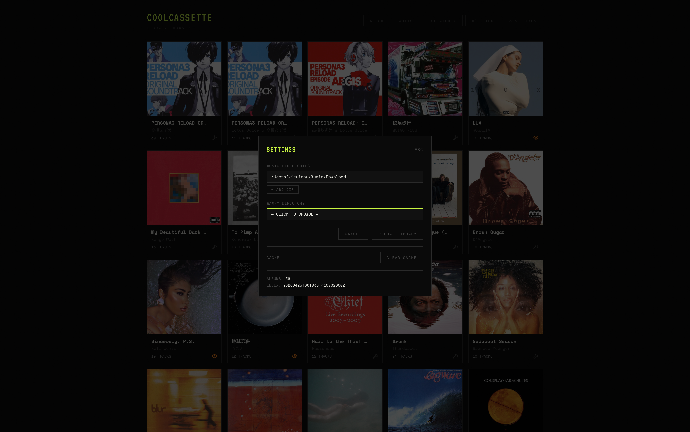
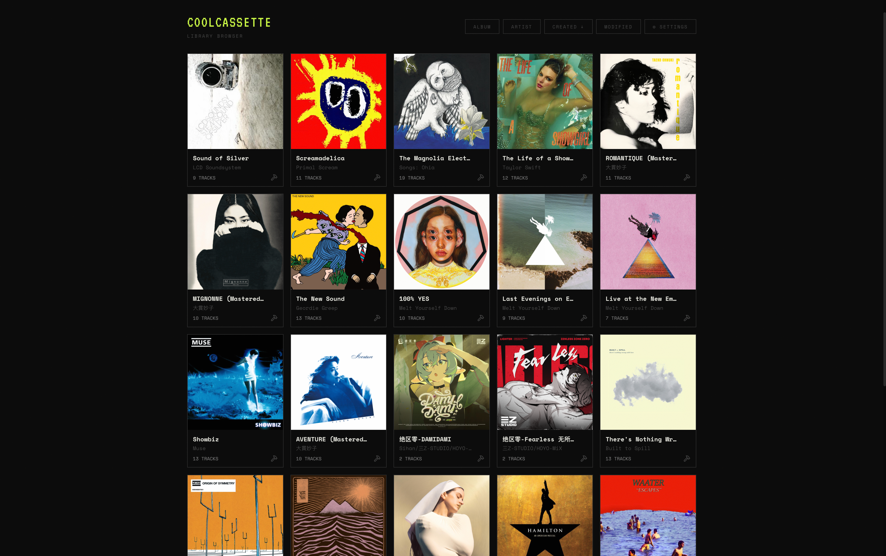
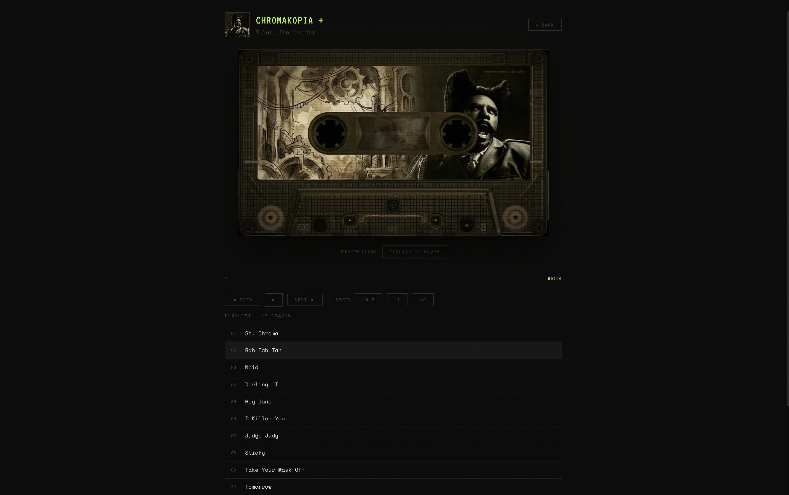
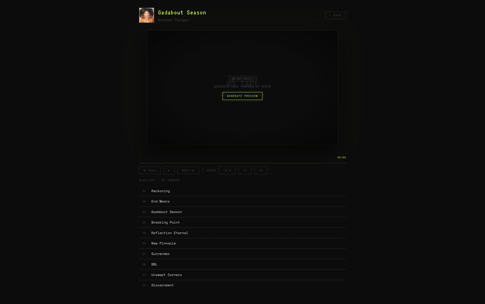

# CoolCassette Web UI

属于 Walkman 专属音乐库浏览器

## 功能

- 目录绑定：可同时绑定内存卡目录和 Walkman 机器目录和 wampy 目录

- 专辑列表：支持按专辑名/艺术家/创建时间/修改时间排序，也可以观察专属的磁带是否准备就绪!

- 磁带动画：兼容 wampy 插件中的磁带格式，播放音乐的同时，欣赏你的专属磁带

- 磁带制作：预览并创建新的磁带动画，然后批量导入到 wampy 目录中

